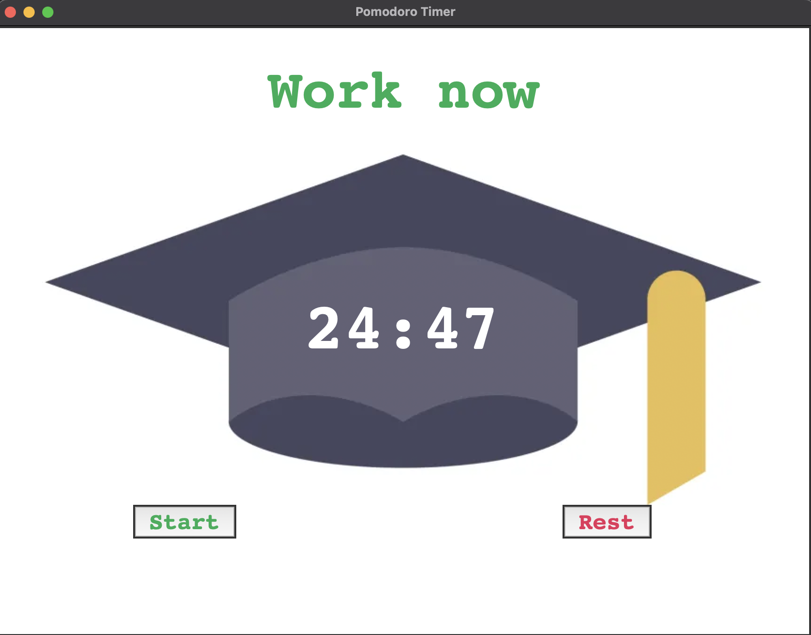

# Pomodoro Study Timer

A customizable Pomodoro timer application built with Python and Tkinter. It allows you to manage your study and break sessions efficiently, inspired by core game mechanics to make tracking progress engaging and fun.



## Features
- Work sessions, short breaks, and long breaks with adjustable durations.
- Visual progress tracking with check marks.
- Easy start and reset controls.
- Stylish background image for an immersive experience.

## How to Run
1. Ensure you have Python installed on your system.
2. Place the entire `PomodoroStudyTimer` folder in your desired location.
3. Run the main Python file inside the `PomodoroStudyTimer` folder:
   
   ```bash
   python PomodoroStudyTimer/main.py
   ```

## Folder Structure
```
/PomodoroStudyTimer
    ├── main.py
    ├── graduationHat.png
    └── 1.png
```

## Acknowledgements
📚 The main idea of this Pomodoro timer was inspired by a Python course. I implemented additional features like the UI, countdown, and check marks myself. This project helped me improve my Python and Tkinter skills. Feel free to customize it!
